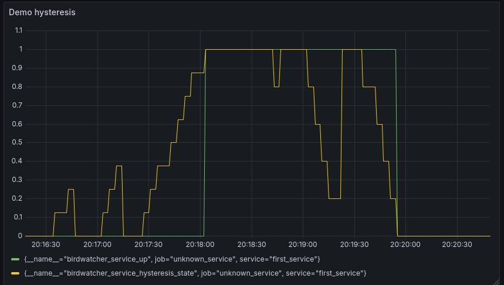

# Birdwatcher-rs

Run periodic healthcheck on a service to automatically stop or start [BIRD](https://bird.network.cz/) advertisements.

Inspired by this [birdwatcher](https://github.com/skoef/birdwatcher) by Skoef.

## Example

Here is a demo of a Grafana dashboard showing the hysteresis of service.
The green curve show when the service is considered active.
The yellow curve show a more detailed view, showing the internal state of birdwatcher-rs



```toml
[generated_file]
path = "birdwatcher_generated.conf"

[bird_reload]
command = ["birdc", "configure"]
timeout_s = 2

[[service_definitions]]
service_name = "first_service"
function_name = "my_service_is_ok"
command = ["my_service_check.sh"]
command_timeout_s = 1
interval_s = 5
fall = 5
rise = 8
```

1. At first, the service is down (green curve at zero)
2. Then, the function return SUCCESS two times in a row, then FAIL, then SUCCESS 3 times in a row. (yellow curve)  
   This does not affect the service as we need 8 SUCCESS to `rise` the service. (see config above).
3. The function return SUCCESS more than 8 times in a row (yellow curve going up to 1), so the service becomes up (green curve to 1).
4. The `generated_file` is regen with `return true` and the `bird reload` command (typically `birdc configure` is called.
5. After sometimes, the function start failing.  
   Note that the yellow curve goes down faster than it goes up, because it only needs 5 FAIL to `fall`.

To reproduce, use the docker compose in `test_tools` folder:
```bash
$ cd test_tools
$ docker compose up --abort-on-container-exit
```

## Usage

### Building

#### With Nix
Quick start:
```
nix run github:pixelshot91/birdwatcher-rs -- --help
```

To use install it on NixOs, look up `integration_test/single_service.nix`

#### Without Nix
1. [Install Rust](https://www.rust-lang.org/tools/install)
2. `cargo run -- --config my_config.toml`

### Configuration

The configuration file use [TOML](https://toml.io/en/).

```toml
[generated_file]
path = "birdwatcher_generated.conf"

[bird_reload]
command = ["birdc", "configure"]
timeout_s = 2

[[service_definitions]]
service_name = "webserver is up"
function_name = "webserver_is_active"
command = ["/bin/curl", "http://localhost:8000/"]
command_timeout_s = 2
interval_s = 1
fall = 1
rise = 3

[[service_definitions]]
service_name = "My important file exist"
function_name = "file_exist"
command = ["/bin/ls", "/root/my_file.txt"]
command_timeout_s = 1
interval_s = 5
fall = 1
rise = 3
```

### Log level of stdout

You can use the environment variable `STDOUT_LOG_LEVEL` to controle the level of log written to stdout. It does not affect the logs send by telemetry.  
Level can be: `error`, `warn`, `info`, `debug`, `trace`  
Levels are defined here: https://docs.rs/tracing-core/0.1.35/tracing_core/metadata/struct.Level.html#implementations

Example: `STDOUT_LOG_LEVEL=info`
By default, only log level `error` are shown.

### Telemetry

By default,telemetry is send to endpoint `http://localhost:4317` using the gRPC protocol.
You can change the endpoint by settings the `OTEL_EXPORTER_OTLP_ENDPOINT` environment variable.  

https://docs.rs/opentelemetry-otlp/0.30.0/opentelemetry_otlp/#constants

Both trace and log can be filtered with the following env var: `OTEL_TRACE_LEVEL`, `OTEL_LOG_LEVEL`.

Note: `OTEL_LOG_LEVEL` and `STDOUT_LOG_LEVEL` can be set to different value.

## Why fork Skoef's birdwatcher

Little improvements over Skoef's birdwatcher:
  - `birdwatcher-rs` does not link a service with a list of IP addresses like `birdwatcher` does.  
  `birdwatcher-rs` only return a function return a simple `true` or `false`, whereas `birdwatcher` force to use a BIRD filter, which might prevent some configuration, and caused some problems.  
  See https://github.com/skoef/birdwatcher/issues/28 and https://github.com/skoef/birdwatcher/issues/25
  - I tried to make `birdwatcher-rs` code simpler. The only moving part is a list of value representing the service states.
  - `birdwatcher-rs` enable the service if the first check is successful, whatever the `rise` value is.
  - It uses Rust, which I find cleaner and prevent entire classes of bugs compared to Go, such as null-pointer exception, generics, sum-type.
  - `birdwatcher-rs` support Nix, for easy and reproducible build. It include an integration test running birdwatcher-rs in a VM with NixOS test framekwork.

## Development
To build from source:
```
nix build
result/bin/birdwatcher-rs --config my_config.toml
```

### RPC framework
For the daemon and the client to communicate, I need a RPC framework.  
I would like it to be, by order of importance:
- correct: The de/serialization code should be generated. Function name should not be matched as string, but be part of Trait. An error in function name, return type, parameter count or type should be a compile-time error.
- thread-safe: Although I do not plan many clients to query the daemon, I still want it to resilient against concurrent queries. It should not be possible for a client to see an answer intended for another client.  
  The framework should link each query/response automatically
- Maintained: A high number of contributor, frequent releases, and no unanswered issues.

Not very useful:
- High performance: It will be used as a monitoring tool, at the very most one query per second.
- Inter-language: The client could be written is something else than Rust.

Option:
- [tonic](https://github.com/hyperium/tonic): Seems to most popular, but need to redefine all struct in protobuf. A one person project [tonci-rpc](https://github.com/adamrk/tonic-rpc) exists to automatically generate the protobuf from the Rust code, but is unmaintained since February 2023.
- [tarpc](https://github.com/google/tarpc) Generate message directly from Rust code, but not lot of activity. Weird dependency on `opentelemetry`.
- [jsonrpsee](https://github.com/paritytech/jsonrpsee) function are not well-typed: function name is a string, and parameter type and count are check at runtime.